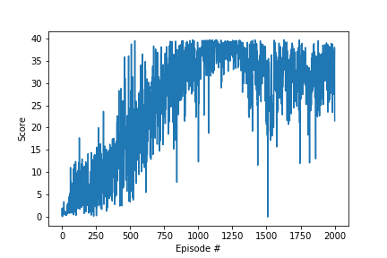

## Deep_Reinforcement_Learning_Udacity_Reacher_One_Agent


This project implements the Reacher Agent in Udacity provided environment. In this environment, a double-jointed arm can move to target locations. A reward of +0.1 is provided for each step that the agent's hand is in the goal location. Thus, the goal of the agent is to maintain its position at the target location for as many time steps as possible. The agent is considered to solve the problem when it is able to collect an average reward of +30 during last 100 episode.

The observation space consists of 33 variables corresponding to position, rotation, velocity, and angular velocities of the arm. Each action is a vector with four numbers, corresponding to torque applicable to two joints. Every entry in the action vector should be a number between -1 and 1.

The agent implements Deep Deterministic Policy Gradient learning method for continuous action spaces. The agent learns with actor-critic method in which both actor and critic is implemented with Fully Connected Network (FCN). There are two copies of both actor and critic networks called local and target networks. Target network weights are copied from local network weights after each learning step through soft update to blend in the new weights into previous weights.

The actor takes the state of the environment and outputs the action vector with continuous values. The critic takes both state and action vectors and outputs the Q value of the state-action pair. The actor network is FCN with 2 hidden layers of 400/300 neurons. The critic network is also FCN network with 3 hidden layers of 400/300/64 neurons. 

When agent acts, noise can be added for exploration. It is also useful to model physical systems where exact action commands cannot be executed due to noise. Experiments have been done both with and without additional noise. When noise is added to the action vector, solution was reached in a longer training period and was susceptible to crashing. Without additional noise, agent trained much quicker and agent was stable afterwards.





After solving environment, model parameters are saved, agent is re-instantiated by loading model parameters and run through one episode with a reward of +35.

```
Total score (averaged over agents) this episode: 35.67999920248985
```


